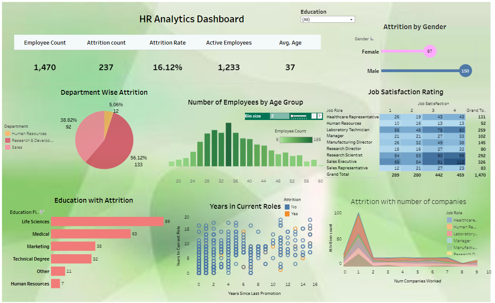

# HR-Attrition-Tableau-Dashboard-Analysis
This project is focused on analyzing HR employee attrition data to cover patterns and trends in employee turnover. The analysis was performed using SQL for data cleaning and preparation, followed by creating visualizations using Tableau to present the insights.

## Tableau Visualization

Below is the HR Attrition Dashboard visualized using Tableau:

### Key Insights from the Dashboard

Department-wise Attrition : The highest attrition rate is in the Research & Development department (56.12%).
.
  
## SQL Queries
- The SQL queries used for data cleaning and analysis were executed on Google BigQuery. You can find the queries in the [SQL folder](link-to-your-SQL-files-on-GitHub).

## Feel Free to Ask
- If you have any questions regarding the analysis, visualization, or data, feel free to reach out!

## References
- You can download the Excel file with the initial dataset and cleaned data [here](HR-Employee-Attrition.csv).
- The dataset is from [Kaggle](https://www.kaggle.com/datasets).
