# HR-Attrition-Tableau-Dashboard-Analysis
This repository contains project is focused on analyzing HR employee attrition data to cover patterns and trends in employee turnover. The analysis was performed using SQL for data cleaning and preparation, followed by creating visualizations using Tableau to present the insights.

## Tableau Visualization

Below is the HR Attrition Dashboard visualized using Tableau:

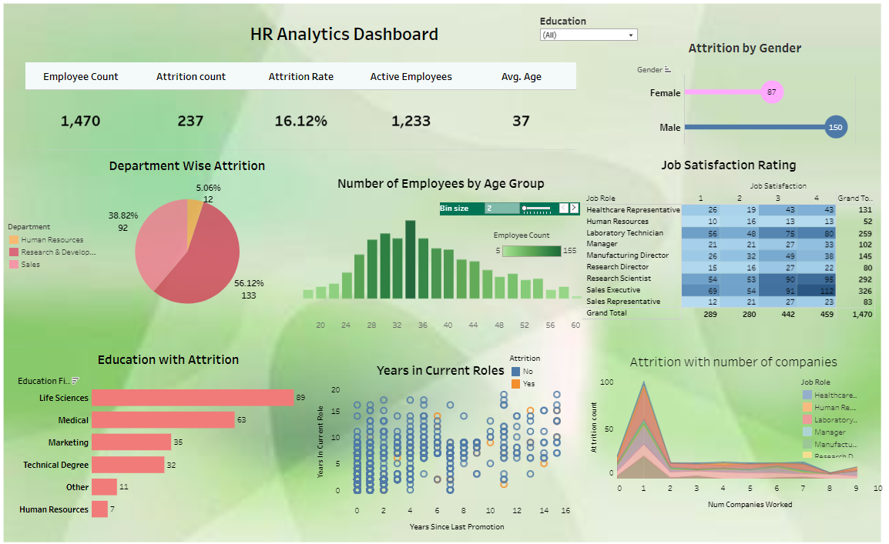 

## Example of Dataset

| Row | Age | Attrition | BusinessTravel   | DailyRate | Department           | DistanceFromHome | Education | EducationField   | Gender | JobRole | MaritalStatus | MonthlyIncome | OverTime | PerformanceRating | TotalWorkingYears | YearsAtCompany |
|-----|-----|-----------|------------------|-----------|----------------------|------------------|-----------|------------------|--------|---------|---------------|---------------|----------|-------------------|-------------------|----------------|
| 1   | 49  | false     | Travel_Rarely    | 1098      | Research & Development | 4                | 2         | Medical          | Male   | Manager | Married       | 18711         | false    | 3                 | 23                | 4              |
| 2   | 50  | false     | Travel_Rarely    | 264       | Sales                 | 9                | 3         | Marketing        | Male   | Manager | Married       | 19331         | true     | 3                 | 27                | 3              |
| 3   | 42  | false     | Travel_Rarely    | 1059      | Research & Development | 9                | 2         | Other            | Male   | Manager | Single        | 19613         | false    | 4                 | 24                | 3              |
| 4   | 58  | false     | Travel_Rarely    | 605       | Sales                 | 21               | 3         | Life Sciences    | Female | Manager | Married       | 17875         | true     | 3                 | 29                | 2              |
| 5   | 46  | false     | Travel_Rarely    | 705       | Sales                 | 2                | 4         | Marketing        | Female | Manager | Single        | 18947         | false    | 3                 | 22                | 2              |
| 6   | 44  | false     | Travel_Rarely    | 1315      | Research & Development | 3                | 4         | Other            | Male   | Manager | Married       | 19513         | true     | 3                 | 26                | 4              |
| 7   | 50  | false     | Travel_Frequently| 1421      | Research & Development | 2                | 3         | Medical          | Female | Manager | Married       | 17856         | false    | 4                 | 32                | 3              |
| 8   | 48  | false     | Travel_Frequently| 365       | Research & Development | 4                | 5         | Medical          | Male   | Manager | Married       | 15202         | false    | 4                 | 23                | 3              |
| 9   | 51  | false     | Travel_Rarely    | 942       | Research & Development | 3                | 3         | Technical Degree | Female | Manager | Married       | 13116         | false    | 3                 | 15                | 3              |
| 10  | 59  | false     | Non-Travel       | 1420      | Human Resources       | 2                | 4         | Human Resources  | Female | Manager | Married       | 18844         | false    | 4                 | 30                | 3              |
| 11  | 29  | false     | Travel_Rarely    | 900       | Research & Development | 10               | 3         | Life Sciences    | Male   | Sales   | Married       | 5000          | false    | 3                 | 10                | 7              |
| 12  | 31  | true      | Travel_Frequently| 900       | Sales                 | 20               | 2         | Marketing        | Female | Manager | Single        | 4500          | true     | 4                 | 8                 | 5              |
| 13  | 45  | false     | Travel_Rarely    | 1100      | Research & Development | 12               | 4         | Technical Degree | Female | Research Scientist | Divorced   | 12000         | false    | 3                 | 15                | 9              |
| 14  | 36  | true      | Travel_Rarely    | 850       | Sales                 | 15               | 3         | Marketing        | Male   | Sales Executive | Married   | 9000          | true     | 3                 | 7                 | 5              |
| 15  | 39  | false     | Travel_Rarely    | 950       | Research & Development | 8                | 2         | Life Sciences    | Female | Manager | Married       | 11000         | false    | 3                 | 12                | 6              |

### Summary Statistics from Dashboard 

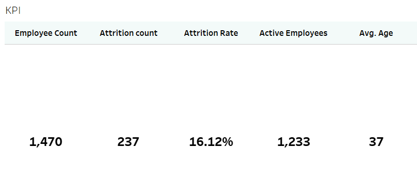 

### Department-wise Attrition 
the highest department attrition rate was Research and department, sales and human resources 

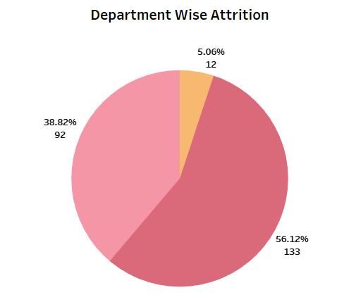 

### Education with Attrition
Life Sciences and Medical education fields show higher attrition rates.

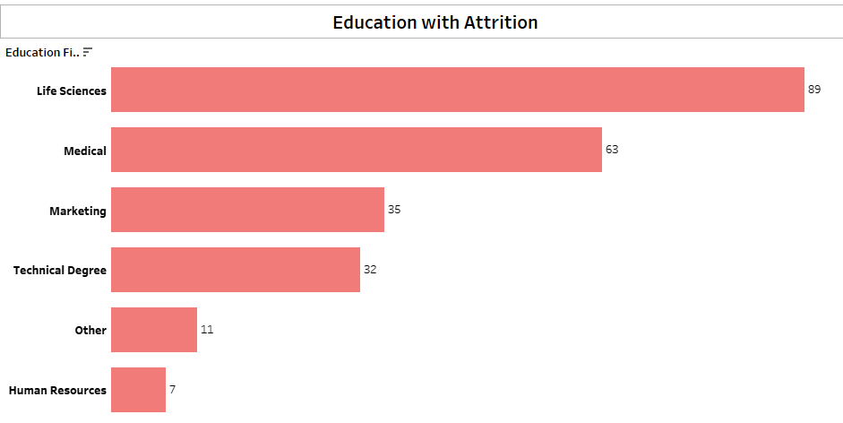 

### Attrition by Gender
 Males show slightly higher attrition rates than Females.

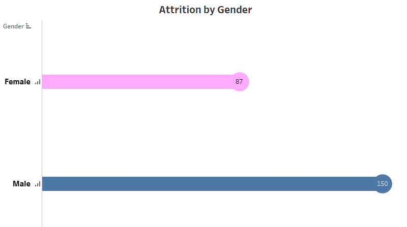 

### Job Satisfaction
Employees with lower job satisfaction have higher rates of attrition.

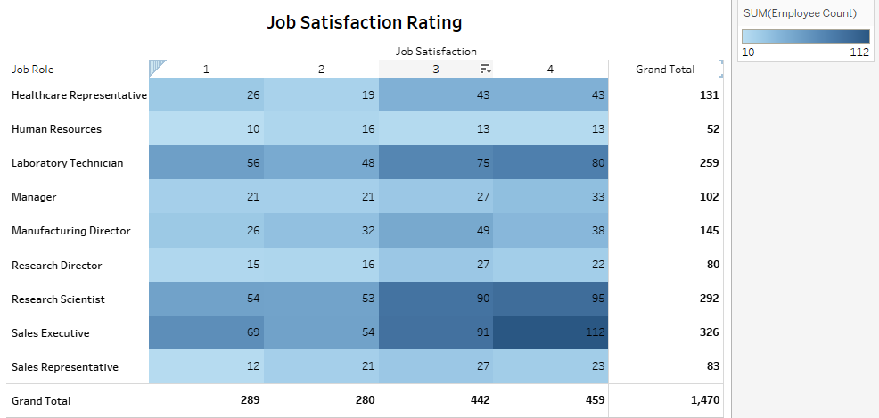 

### Attrition with Number of Companies Worked
The graph shows that employees who have worked at only one company tend to have the highest attrition rate.

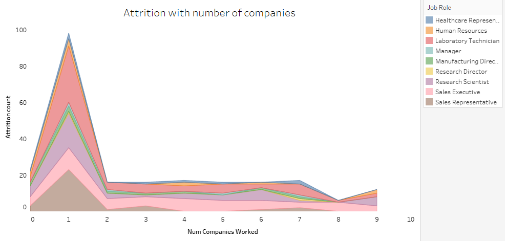 

### Number of Employees by age group
represent the total number of Employees by different age groups.

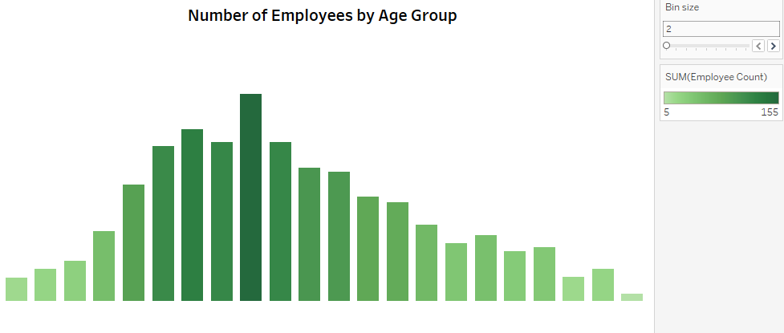 

### Attrition with Different Age Groups 
represent the total number of Attrition by different age group, shows that the highest Attrition at age of 28 and 30 .

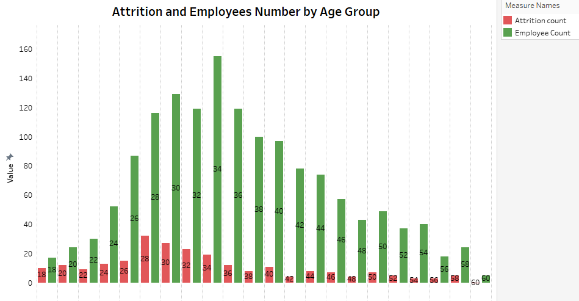 

### Attrition by Years in current Role
it shows hight Attrition rate at first years of work .

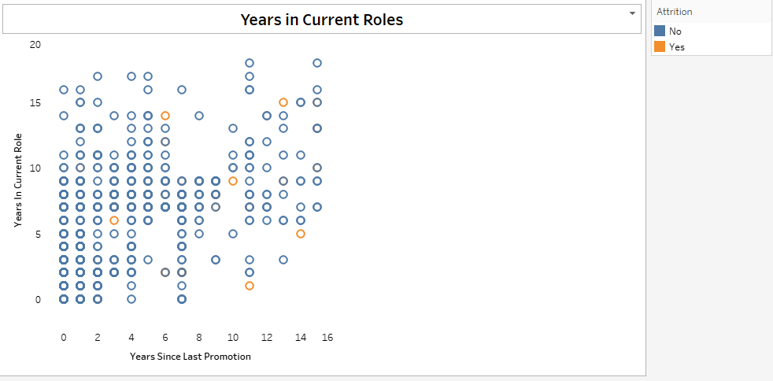 

you can see Hight Attrition by orange.

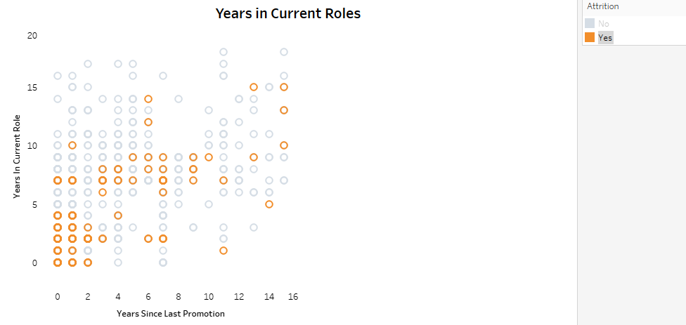 

  
  

## Conclusion

**●**  The analysis successfully explored various factors contributing to employee attrition within the HR Employee Attrition dataset.

**●** 237 employees were identified as having left the organization, with an overall attrition rate of approximately 16.1%.

**●**  The highest attrition rates were observed in the Sales department (20.63%) and Research & Development (13.84%), indicating potential areas of concern for employee retention strategies.

**●**  Job roles are associated with attrition rates.

**●** Employees in the first years at the company, and younger Employees most likely to leave. 

**●** Further analysis is recommended to investigate other factors influencing attrition, such as work-life balance, and career advancement opportunities.

## Data Source
- The dataset used for this analysis was obtained from [Kaggle's HR Attrition Dataset](https://www.kaggle.com/datasets).
  
## SQL Queries
- The SQL queries used for data cleaning and analysis were executed on Google BigQuery. You can find the queries in the [SQL folder](https://github.com/Israa-Idris/HR-Attrition-SQL-Analysis/tree/main).

## Feel Free to Ask
- If you have any questions regarding the analysis, visualization, or data, feel free to reach out!

## References
- You can download the Excel file with the initial dataset and cleaned data [here](HR-Employee-Attrition.csv).
